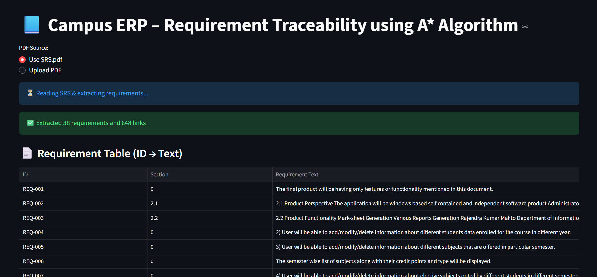
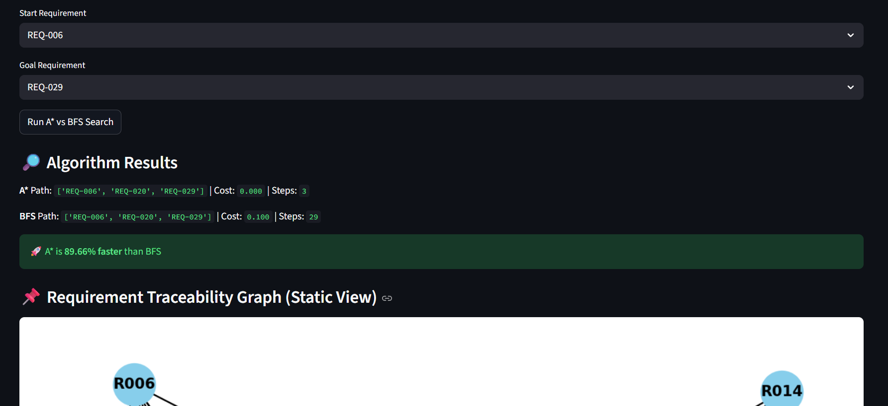
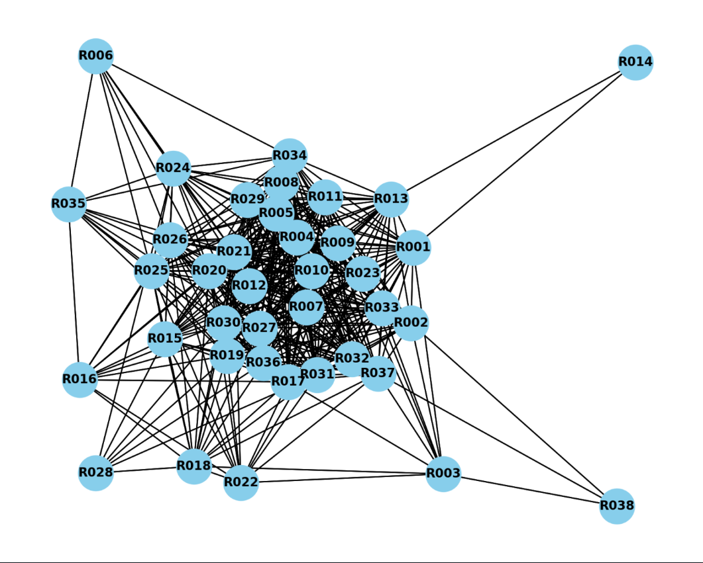

# Campus ERP – Requirement Traceability using A* Algorithm (vs BFS)

An interactive **Streamlit** web app (pure Python) that parses an **SRS PDF**, builds a **requirement traceability graph**, and compares **A\*** with **BFS** for finding the optimal requirement path.



## ✨ What it does
- **Extracts requirements** from an SRS PDF (ID → text, section).
- Builds a **directed, weighted traceability graph** using textual similarity + section distance.
- Runs **A\*** and **BFS** between any two requirement IDs; reports **path, cost, and steps**.
- Shows **performance gain** of A\* over BFS and renders a **NetworkX graph**.
- Works with the included `SRS.pdf` or your own uploaded PDF.

## 🚀 Tech Stack
- **Python**: 3.9+
- **Libraries**: `streamlit`, `networkx`, `matplotlib`, `pdfminer.six`, `numpy`
- Optional frontend libs bundled in `/lib` (tom-select, vis-network) for future interactive views.

## 📂 Project Structure
```
campus-erp/
├─ app.py                  # Streamlit UI: PDF input, run A* vs BFS, plots
├─ traceability_core.py    # Parsing, graph building, A*, BFS
├─ SRS.pdf                 # Sample SRS used in the demo
└─ lib/                    # Front-end assets (not required to run basic app)
```
> From the sample run: **38 requirements** and **~848 links** were extracted.

## ⚙️ Setup
```bash
# 1) Create & activate a virtual env (recommended)
python -m venv .venv
# Windows
.venv\Scripts\activate
# macOS/Linux
# source .venv/bin/activate

# 2) Install dependencies
pip install -r requirements.txt
```

## ▶️ Run
```bash
streamlit run app.py
```
Open the local URL that Streamlit prints (usually http://localhost:8501).

## 🧠 How it works (high level)
- **PDF → Requirements**: `pdfminer.six` extracts text. Regex pulls **REQ-xxx** style IDs and their descriptions.
- **Edges**: Weighted by textual similarity and section distance; lower cost = tighter relation.
- **Search**:
  - **A\*** uses an admissible heuristic from section gaps and token overlap → **faster** and **cost-aware**.
  - **BFS** explores level-by-level → **baseline** (no weights).
- **Output**: Shortest path, cumulative cost, and number of node expansions (*steps*).

## 🧪 Example
With start=`REQ-006`, goal=`REQ-029` the demo shows:
- **A\*** path: `REQ-006 → REQ-020 → REQ-029`, cost≈`0.000`, steps=`3`
- **BFS** path: `REQ-006 → REQ-020 → REQ-029`, cost≈`0.100`, steps=`29`
- **A\*** is ~**90% faster** than BFS in node expansions.

## 🖼 Screenshots



## 📜 Requirements
See `requirements.txt` in this repo. Minimal list:
```
streamlit
networkx
matplotlib
pdfminer.six
numpy
```
> If you see font/GUI issues on some Linux distros, install system packages: `libfreetype6`, `libpng`.

## 🧩 Useful commands
```bash
# format
python -m pip install black isort
black . && isort .
```

## ☁️ Publish to GitHub
```bash
git init
git add .
git commit -m "Initial commit: Campus ERP traceability (A* vs BFS)"
git branch -M main
git remote add origin https://github.com/<your-username>/<repo-name>.git
git push -u origin main
```

## 📄 License
MIT (or the license you prefer).

## 🙌 Acknowledgements
- Built with ❤️ using Streamlit, NetworkX, Matplotlib, and pdfminer.six.
